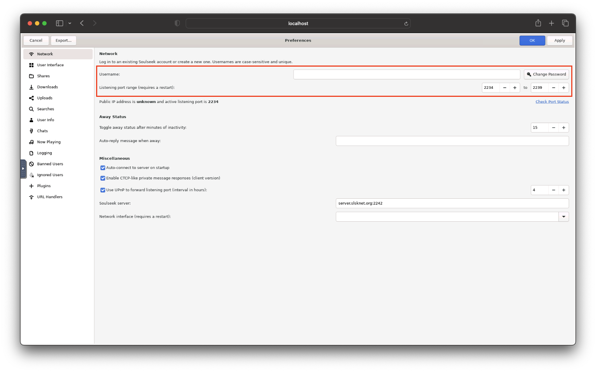

# [Docker Nicotine+](https://github.com/mrgasparov/nicotine-novnc)


## Introduction

[Nicotine+](https://nicotine-plus.org/) is a graphical client for the Soulseek peer-to-peer network. It aims to be a lightweight, pleasant, free and open source (FOSS) alternative to the official Soulseek client, while also providing a comprehensive set of features.

[noVNC](https://novnc.com) is an open source VNC client which is both a VNC client JavaScript library as well as an application built on top of that library.

This docker image allows you to run Nicotine+ on a Raspberry Pi or your NAS, and access it via the browser from your laptop. It includes the latest Nicotine+ version running on GTK4 and is built to ensure a simple and secure setup.

### Acknowledgements

This docker image is based on the excelent [realies/soulseek-docker](https://github.com/realies/soulseek-docker), which uses SoulseekQT instead of Nicotine+.

## Supported Architectures

Simply pulling `mrgasparov/nicotine-novnc:latest` should retrieve the correct image for your architecture. The list of supported architectures is the following:

| Architecture | Available | Devices
| :----: | :----: | ---
| x86-64 | ✅ | Synology NAS, PC, Intel Mac
| arm64 | ✅ | Raspberry Pi 4, M1 Mac
| armhf | ✅ | Raspberry Pi 3

## Deployment

### docker-compose

```yaml
services:
  nicotine:
    image: mrgasparov/nicotine-novnc:2.0
    container_name: nicotine
    restart: unless-stopped
    environment:
      - RESOLUTION=1920x1080
      - PORT=6080
      - PUID=1000
      - PGID=1000
    ports:
      - "6080:6080" # UI port
      - "2234-2239:2234-2239" # Listening port range
    volumes:
      - /home/user/nicotine/config:/config
      - /home/user/nicotine/downloads:/downloads
```

### docker cli

```bash
docker run -d \
  --name=nicotine-novnc \
  -e PORT=6080 \
  -e RESOLUTION=1920x1080 \
  -e PUID=1000 \
  -e PGID=1000 \
  -p 6080:6080 \
  -p 2234-2239:2234-2239 \
  -v /home/user/nicotine/config:/config \
  -v /home/user/nicotine/downloads:/downloads \
  --restart unless-stopped \
  mrgasparov/nicotine-novnc:latest
```

## Usage

1. Open your browser and go to `[device-ip]:6080`
2. Open the preferences window

3. Enter your username and password and choose listening port. The listening port must be within the range of the ports you exposed during deployment (i.e. `2234-2239`)

4. Choose your incomplete, downloads and uploads folders, which should be located under the `/downloads` folder

5. Choose the folders you want to share, which should be located under the `/downloads` folder


## Parameters

### Environment Variables

| Variable | Description | Required | Default
| :----: | --- | :---: | :---:
| `NOVNC_PORT` | Port for accessing Nicotine+ in the browser | No | `6080`
| `RESOLUTION` | Set a resolution for Nicotine+ | No | `1280x720`
| `PUID` | Match internal user ID to the ID of your host user. Needs `PGID` to be set | No | `0` (root)
| `PGID` | Match internal group ID to the ID of your host group. Needs **`PUID`** to be set  | No | `0` (root)
| `UMASK` | Defines permissions for newly created files. Defaults to  | No | `0000`

### Volumes

| Volume | Description
| :----: | ---
| `/config` | Path to persistently mount Nicotine+ configuration folder
| `/downloads` | Path to persistently mount download folder
